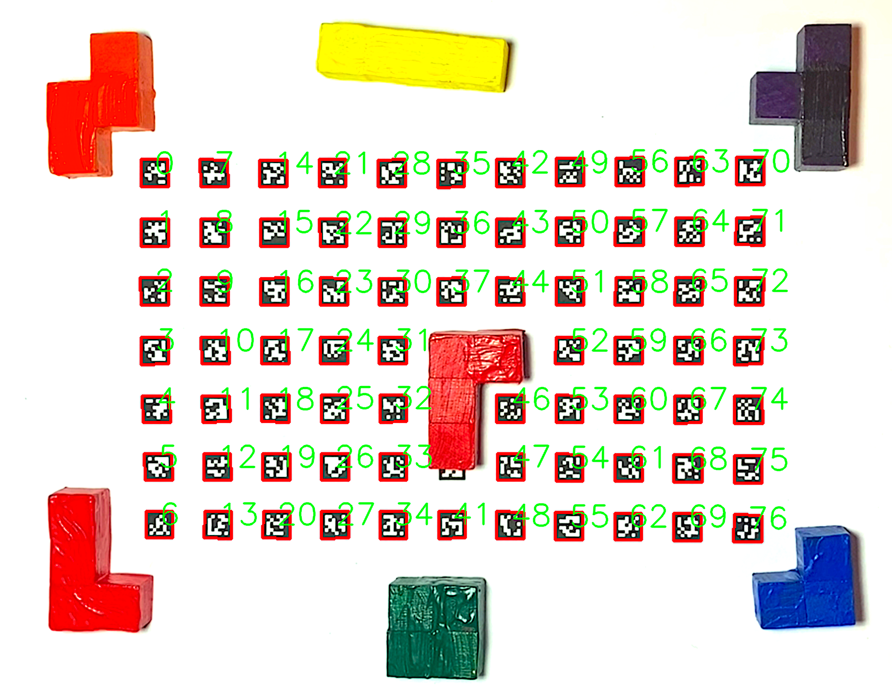

# Polyomino

# Grain Bau
.

The polyomino interface is a pitch lattice exploration interface combining object detection with haptic elements. It uses fiducial markers, the   [AprilTag markers](https://april.eecs.umich.edu/software/apriltag), to represent a square pitch lattice. Covering these markers, intended to be done using polyominos, one can send the pitch information of the covered cells to a Csound script for sonification.
The python script uses [OSC](https://ccrma.stanford.edu/groups/osc/index.html) to communicated with the Csound program.

## Installation 
Download the zip file or clone the repository
### Python
Before installing any dependencies, I recommend using a seperate virtual environment
```
conda create -n polyomino python=3.11
```
Now activate the new environment
```
conda activate polyomino
```
To install the required libraries for cloud hands, simply open a terminal at the root directory and execute
```
pip install -r requirements.txt
```
### Csound

You can download Csound from [here.](https://csound.com/download.html)


## Play 
First activate the python environment.
```
conda activate polyomino
```

To start the python script:
```
python detect.py
```

In a new terminal window, start the csound script. Make sure to find out which -odac option (line 3) you want to use. If you start the script once without the python script running, you can see your options.
```
csound polyomino.csd
```

The python script does not send the pitch information automatically. To update the pitch information, press the 'x' key while the python window is active.

## Getting started
If you have never dealt with eitehr python or Csound, you can find some pointers in this section.

### Python
Make sure you have a conda distribution installed on your machine.
[Miniconda](https://docs.anaconda.com/free/miniconda/miniconda-install/) is a good start if you are only interested in conda for this repo.
To see if you have a version of conda installed, open your terminal and type
```
conda --version
```
It should tell you the version as well.
Conda does package and environment management for you, which helps you to use the right package in the right envirnoment for the right project. 

### Csound
To see if you have a Csound version installed, open your terminal and type
```
csound --version
```
It should tell you the version as well.
